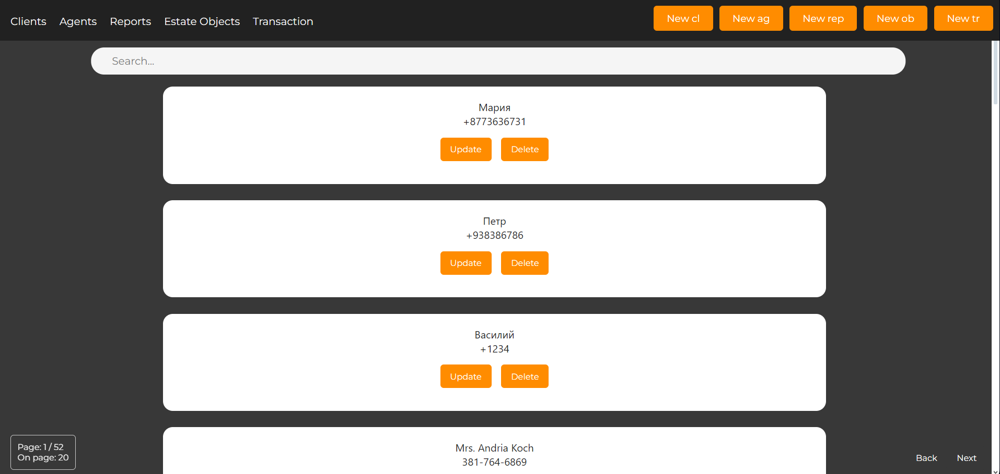
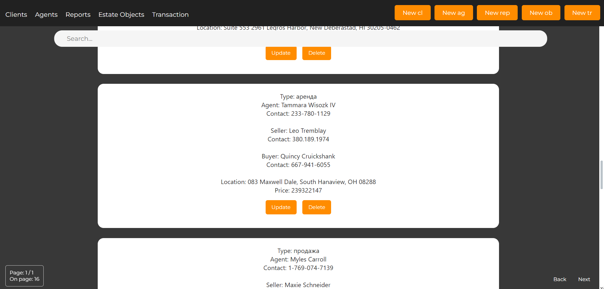
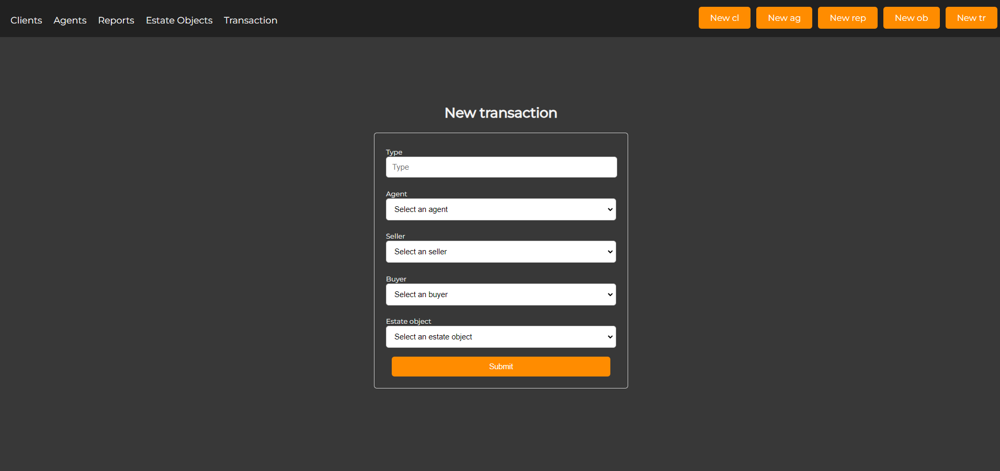
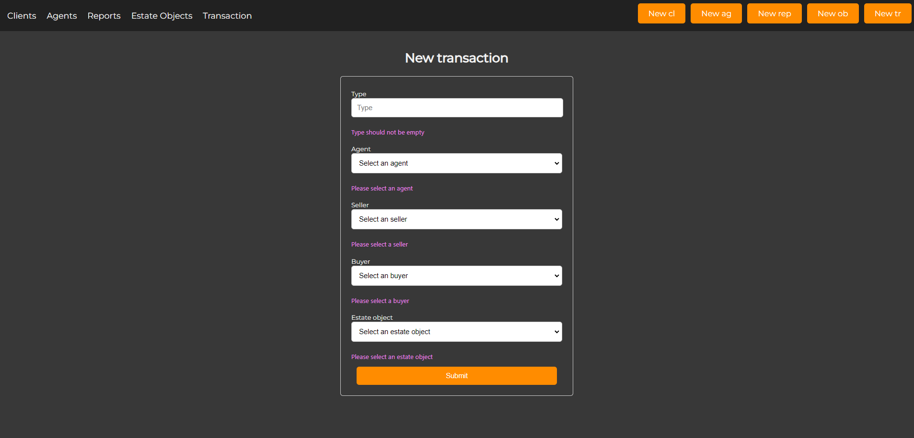
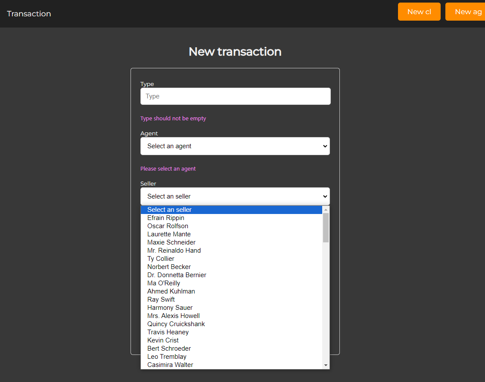

In the project directory, you can run:

### `npm start`

Frontend for the project Real Estate Agency

  Stack:
  Frontend: React
  Backend: Java, Spring
  database: PostgreSQL

  Task:
A completed application according to the task text:
1. having a clear and logical interface;
2. allowing to view and modify data (if it does not contradict logic) of all tables;
3. having the ability to search/filter by several parameters with page-by-page output;
4. able to display some statistical information (total number of records, most popular ones, etc.);
5. having protection against incorrect user actions (for most cases).

The data was generated using the Faker library

Main Page (agents list):

Transactions page:

Transaction creation page:

Protection against empty fields:

Drop-down list:

