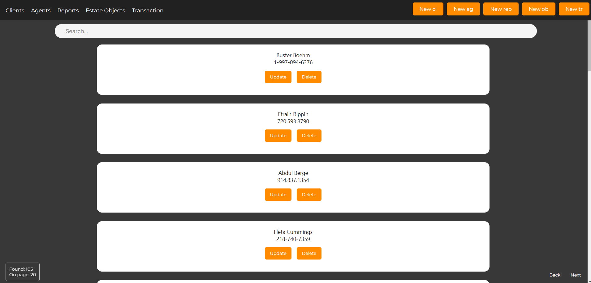

In the project directory, you can run:

npm start
Frontend for the project Real Estate Agency

Stack: Frontend: React Backend: Java, Spring database: PostgreSQL

Task: A completed application according to the task text:

having a clear and logical interface;
allowing to view and modify data (if it does not contradict logic) of all tables;
having the ability to search/filter by several parameters with page-by-page output;
able to display some statistical information (total number of records, most popular ones, etc.);
having protection against incorrect user actions (for most cases).

Main Page:

Transactions page:

Transaction creation page:

Protection against empty fields:

Drop-down list: